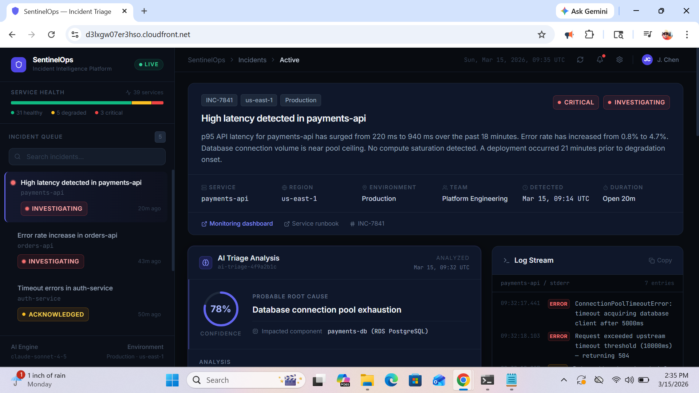
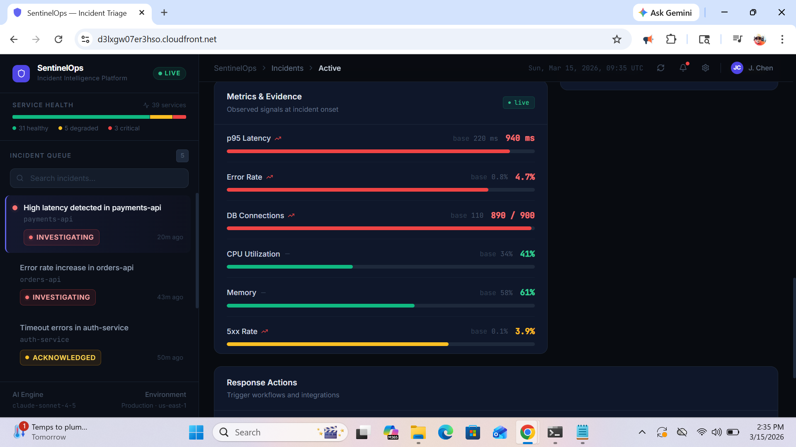
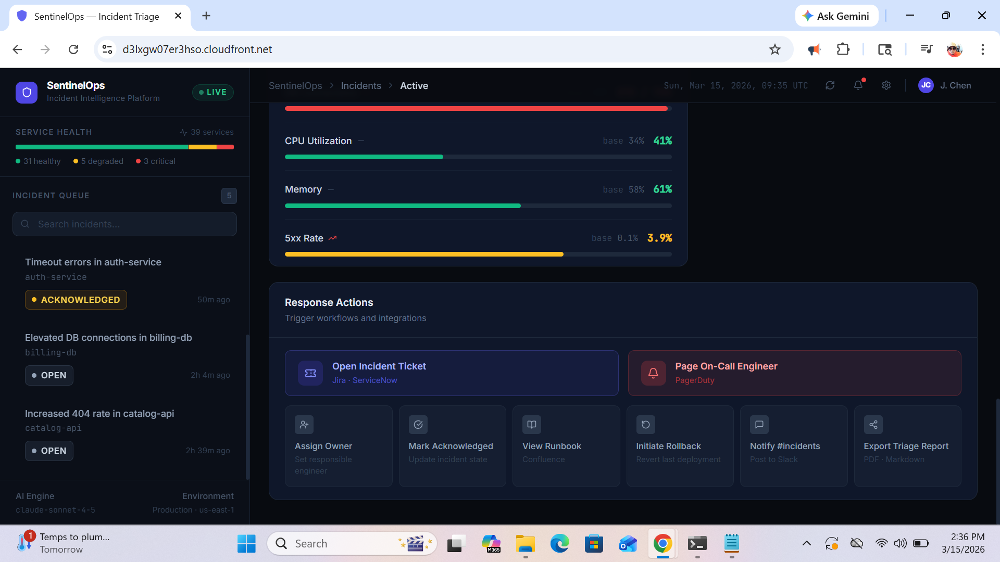

# SentinelOps

**AI-Assisted Incident Triage Platform for Cloud Operations Teams**

SentinelOps is a fully serverless incident response platform that uses Anthropic Claude to automatically triage cloud incidents — identifying probable root causes, reasoning over signals, and generating ranked remediation steps in seconds.

**[Live Demo →](https://d3lxgw07er3hso.cloudfront.net)**

---

## Screenshots


*Main dashboard — incident queue, severity indicators, and active triage view*


*AI triage panel — confidence ring, probable root cause, and ranked remediation steps*


*Metrics panel — live readings with baseline comparison and trend indicators*


*Response actions — Jira, PagerDuty, Slack modals and status lifecycle controls*

---

## Key Features

- **AI Triage Engine** — Claude analyzes metrics, logs, and deployment context to produce a structured diagnosis: probable root cause, confidence score (visualized as a ring), impacted component, reasoning narrative, and ranked remediation steps
- **Incident Queue** — Severity-sorted live queue with search, status badges, and time-since-detection
- **Metrics Panel** — Per-metric progress bars with baseline comparison and trend direction
- **Logs Panel** — Terminal-style log viewer with per-level coloring (ERROR / WARN / INFO)
- **Deployment Timeline** — Visual correlation between recent deploys and incident detection window
- **Response Actions** — Jira ticket preview, PagerDuty page modal, Slack message preview, owner assignment, rollback trigger, runbook link, report export
- **Incident Timeline** — Chronological event log that appends in real time as operators take actions
- **Status Lifecycle** — `open → investigating → acknowledged → mitigated → resolved` tracked via real API calls to DynamoDB

---

## Architecture

```
┌─────────────────────────────────────────────────────────┐
│                      CloudFront CDN                      │
│                  React + Vite + Tailwind                 │
└───────────────────────┬─────────────────────────────────┘
                        │ HTTPS
┌───────────────────────▼─────────────────────────────────┐
│               API Gateway (HTTP API v2)                  │
└──┬──────────────┬──────────────┬───────────────┬────────┘
   │              │              │               │
┌──▼───┐    ┌────▼────┐   ┌─────▼─────┐  ┌─────▼──────┐
│ingest│    │ enrich  │   │  analyze  │  │  update    │
│Incid.│    │Incident │   │  Incident │  │  Status    │
│      │    │Context  │   │  (Claude) │  │            │
└──┬───┘    └────┬────┘   └─────┬─────┘  └─────┬──────┘
   │              │              │               │
   └──────────────┴──────────────┴───────────────┘
                        │
              ┌─────────▼──────────┐
              │      DynamoDB      │
              │  sentinelops-      │
              │    incidents       │
              └────────────────────┘
                        │
              ┌─────────▼──────────┐
              │  SSM Parameter     │
              │  Store (API key)   │
              └────────────────────┘
```

See [`architecture.svg`](architecture.svg) for the full annotated diagram.

---

## System Architecture

SentinelOps is built entirely on AWS serverless primitives with no persistent infrastructure to manage.

| Layer | Service | Detail |
|---|---|---|
| Frontend | S3 + CloudFront | Vite production build, globally cached via CDN |
| API | API Gateway HTTP API v2 | Single-stage, CORS-enabled, routes to Lambda |
| Compute | AWS Lambda (arm64) | Node.js 22.x on Graviton2 — ~20% cost reduction |
| Storage | DynamoDB | On-demand billing, single-table with `id` hash key |
| Secrets | SSM Parameter Store | `SecureString` for Anthropic API key, module-level cached |
| IaC | AWS SAM | `template.yaml` defines all resources; `sam deploy` to ship |

All Lambda functions share a managed IAM policy scoped to the minimum required DynamoDB actions and SSM `GetParameter` on the specific key path.

---

## Incident Lifecycle

```
POST /incidents
      │
      ▼
  Validate input
      │
      ▼
  Generate incident ID + timestamp
      │
      ▼
  enrichIncidentContext()
  (structures metrics, logs, deployment into signal snapshot)
      │
      ▼
  runTriageAnalysis()
  (builds structured prompt → Claude API → parses JSON response)
      │
      ▼
  putIncident() → DynamoDB
      │
      ▼
  Return full incident + triage to client
```

Re-analysis is available at any time via `POST /incidents/{id}/analyze`, which re-runs the Claude call against the stored incident context and persists the updated triage result.

---

## Operations Workflow

Once an incident is ingested, operators work through the response panel:

1. **Review AI triage** — root cause, confidence score, impacted component, and reasoning
2. **Check evidence** — correlated metrics, log entries, and deployment correlation timeline
3. **Take action** — page on-call, open a Jira ticket, notify Slack, assign an owner
4. **Update status** — acknowledge → mitigate → resolve (each step calls the real API and appends to the incident timeline)
5. **Re-analyze** — request a fresh Claude pass if new evidence has been added

Every action taken is recorded in the **Incident Timeline**, providing a full audit trail of who did what and when during the response.

---

## AI Triage Engine

The triage system is built around a structured prompt sent to `claude-sonnet-4-5-20251001`. The prompt includes:

- Incident metadata (service, severity, region, environment)
- Metric readings with baseline comparisons and trend directions
- Timestamped log entries filtered by level
- Deployment context (version, time before incident, change type)

Claude is instructed to return a strict JSON object:

```json
{
  "probableCause": "string",
  "confidence": 0-100,
  "impactedComponent": "string",
  "reasoning": "string",
  "actions": ["string"]
}
```

The prompt includes explicit reasoning guidelines — how to calibrate confidence when evidence is sparse, when to flag deployment correlation, and how to distinguish CPU saturation from downstream failures. Markdown fences are stripped before JSON parsing. Invalid responses surface a structured error rather than crashing.

The confidence score drives the visual ring in the UI: **indigo** (70%+), **amber** (50%+), **slate** (low confidence). Red is reserved for severity signals only.

---

## Technology Stack

| Category | Technology |
|---|---|
| Frontend framework | React 18 + TypeScript |
| Build tool | Vite |
| Styling | Tailwind CSS 3 |
| Backend runtime | Node.js 22.x (AWS Lambda, arm64) |
| API layer | AWS API Gateway HTTP API v2 |
| Database | Amazon DynamoDB |
| Infrastructure as Code | AWS SAM |
| Secrets management | AWS SSM Parameter Store |
| AI engine | Anthropic Claude (`claude-sonnet-4-5`) |
| Hosting | S3 + CloudFront |
| Icons | Lucide React |

---

## Project Structure

```
sentinelops/
├── src/                          # React frontend
│   ├── components/
│   │   ├── layout/
│   │   │   ├── Sidebar.tsx       # Incident queue + search
│   │   │   └── TopBar.tsx        # Breadcrumb, notifications, settings
│   │   ├── triage/
│   │   │   ├── AITriagePanel.tsx     # Confidence ring + root cause
│   │   │   ├── DeploymentPanel.tsx   # Deploy correlation timeline
│   │   │   ├── IncidentHeader.tsx    # Title, tags, meta grid
│   │   │   ├── IncidentTimeline.tsx  # Live event log
│   │   │   ├── LogsPanel.tsx         # Terminal-style log viewer
│   │   │   ├── MetricsPanel.tsx      # Metric bars with baselines
│   │   │   └── ResponseActionsPanel.tsx  # Action buttons + modals
│   │   └── ui/
│   │       ├── Badge.tsx         # SeverityBadge, StatusBadge, Tag
│   │       ├── Button.tsx        # 5 variants
│   │       └── Toast.tsx         # Toast notification system
│   ├── data/incidents.ts         # Mock incident data (5 incidents)
│   ├── pages/Dashboard.tsx       # Main layout + state
│   ├── services/api.ts           # API integration layer
│   └── types/index.ts            # Shared domain types
│
├── backend/
│   └── src/
│       ├── lambdas/
│       │   ├── analyzeIncident.ts
│       │   ├── enrichIncidentContext.ts
│       │   ├── getIncidents.ts
│       │   ├── ingestIncident.ts
│       │   └── updateIncidentStatus.ts
│       ├── lib/
│       │   ├── claude.ts         # Prompt → Claude → parse → validate
│       │   ├── dynamo.ts         # DynamoDB Document Client wrappers
│       │   ├── enrich.ts         # Signal snapshot builder
│       │   ├── http.ts           # Response helpers + CORS
│       │   └── ssm.ts            # API key fetch with module-level cache
│       ├── prompts/triage.ts     # Structured triage prompt builder
│       └── types/index.ts        # Backend domain types
│
├── template.yaml                 # AWS SAM infrastructure definition
├── architecture.svg              # System architecture diagram
└── docs/                         # Screenshots
```

---

## Running Locally

**Prerequisites:** Node.js 22+, AWS CLI configured, Anthropic API key

```bash
# Clone
git clone https://github.com/eburns3000/SentinelOps.git
cd SentinelOps

# Frontend — runs against mock data, no backend required
npm install
npm run dev
# → http://localhost:5173

# Backend (optional — for live API calls)
cp backend/.env.example backend/.env
# Fill in ANTHROPIC_API_KEY, DYNAMODB_TABLE_NAME, AWS_REGION

cd backend
npm install
npm run build

# Invoke a Lambda locally with SAM
sam local invoke IngestIncidentFunction --event events/ingest.json
```

The frontend falls back to built-in mock incident data when `VITE_API_URL` is not set, so the full UI works offline for development.

---

## Deployment

**Prerequisites:** AWS CLI, SAM CLI, Anthropic API key

```bash
# 1. Store API key in SSM (one-time setup)
aws ssm put-parameter \
  --name sentinelops-anthropic-api-key \
  --value "sk-ant-..." \
  --type SecureString

# 2. Build and deploy backend
sam build
sam deploy \
  --stack-name sentinelops \
  --region us-east-1 \
  --capabilities CAPABILITY_IAM CAPABILITY_NAMED_IAM \
  --resolve-s3 \
  --parameter-overrides Stage=prod
# Outputs: API Gateway URL

# 3. Set API URL and build frontend
echo "VITE_API_URL=https://<api-id>.execute-api.us-east-1.amazonaws.com/prod" > .env.local
npm run build

# 4. Deploy to S3 and invalidate CloudFront
aws s3 sync dist/ s3://<your-bucket>/ --delete
aws cloudfront create-invalidation --distribution-id <id> --paths "/*"
```

---

## Design Decisions

**arm64 / Graviton2**
All Lambdas run on `arm64`. Graviton2 costs ~20% less than `x86_64` at equivalent performance for Node.js workloads — a meaningful saving at scale for a high-frequency triage platform.

**HTTP API v2 over REST API**
HTTP API is ~70% cheaper and lower latency. Gateway-level request validation and usage plans are not needed — those concerns are handled in the Lambda layer where they can be tested independently.

**DynamoDB on-demand billing**
Incident volume is unpredictable and bursty. On-demand eliminates capacity planning and scales to any throughput without pre-provisioning or the risk of throttling during an active incident surge.

**SSM over Secrets Manager**
The platform manages a single API key. SSM Parameter Store `SecureString` is sufficient and free within standard throughput limits. The key is cached at Lambda module scope so warm invocations pay zero SSM latency.

**Mock data fallback**
The frontend always renders a fully functional UI regardless of backend state. This is intentional — the demo remains presentable to anyone reviewing the project, independent of whether the backend is provisioned.

---

## Why This Project Exists

Modern SRE and platform engineering teams spend a significant portion of incident response time just gathering context — correlating metrics, scanning logs, checking recent deployments. SentinelOps demonstrates how a Claude-powered triage layer can compress that time to near-zero by structuring signal gathering and reasoning into a repeatable, auditable pipeline.

The project also demonstrates end-to-end ownership of a production-grade serverless system: infrastructure as code, secrets management, typed API boundaries, IAM least-privilege, and a polished operator-facing UI — the same set of concerns a senior engineer is accountable for in a real cloud platform team.

---

## Author

**Elijah Burns**

[GitHub](https://github.com/eburns3000) · [Live Demo](https://d3lxgw07er3hso.cloudfront.net)
